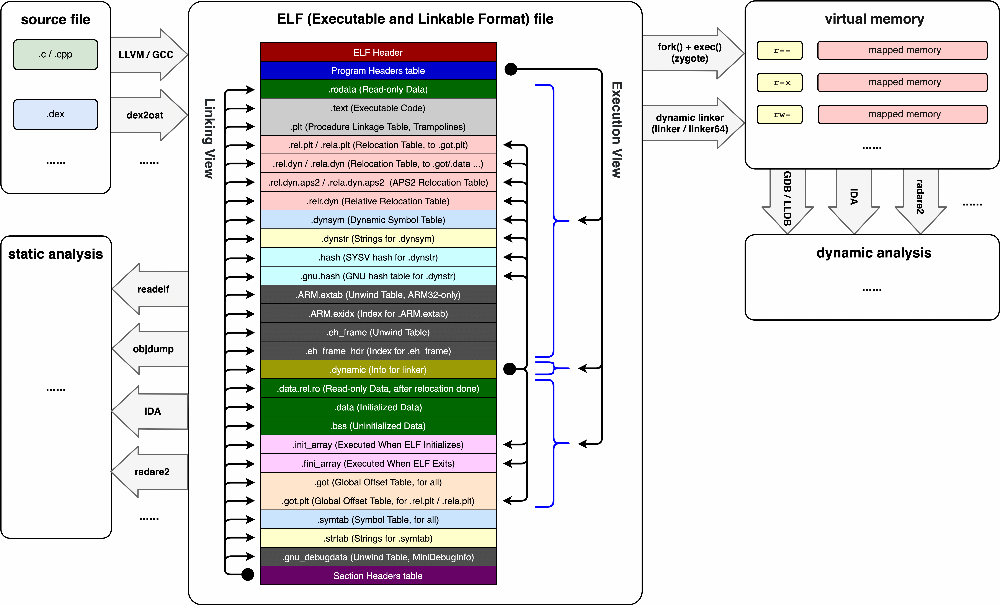
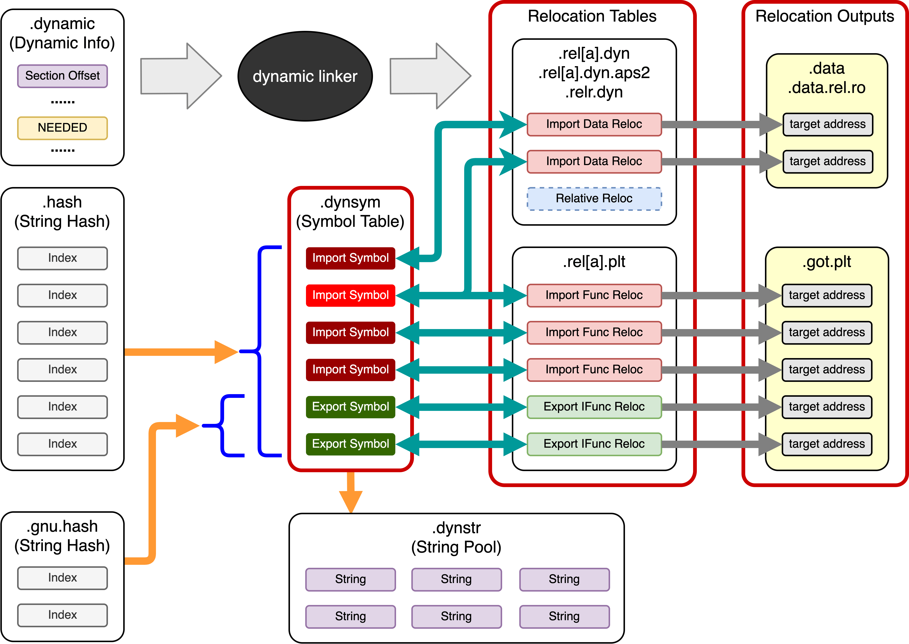
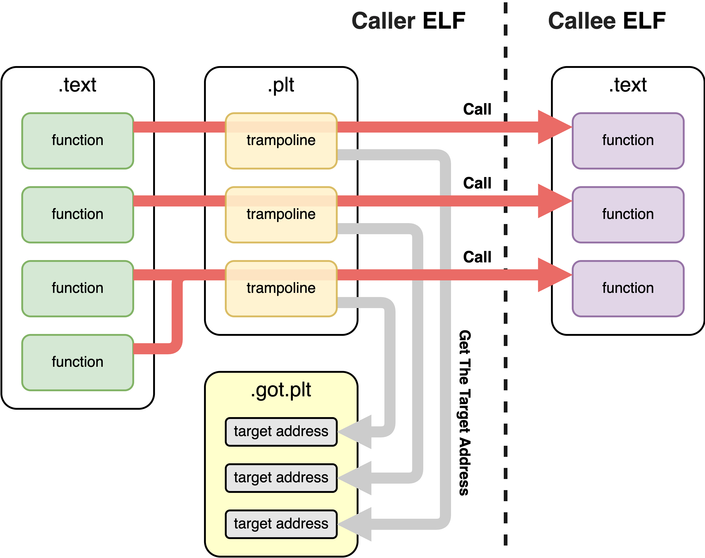
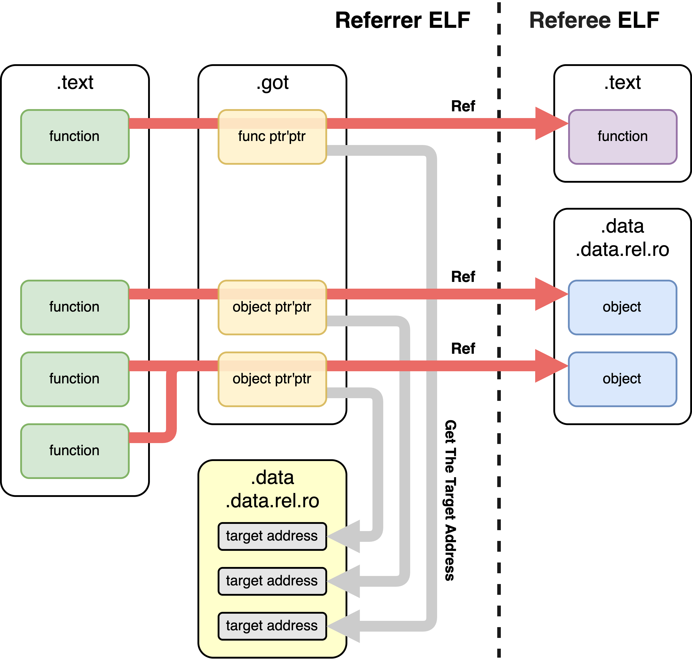
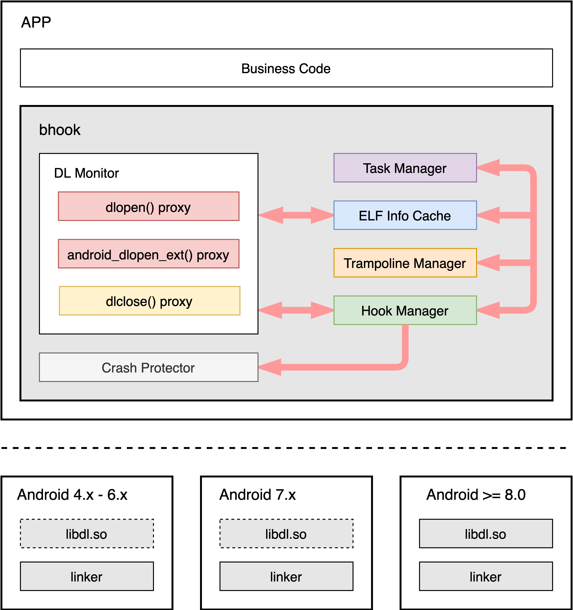
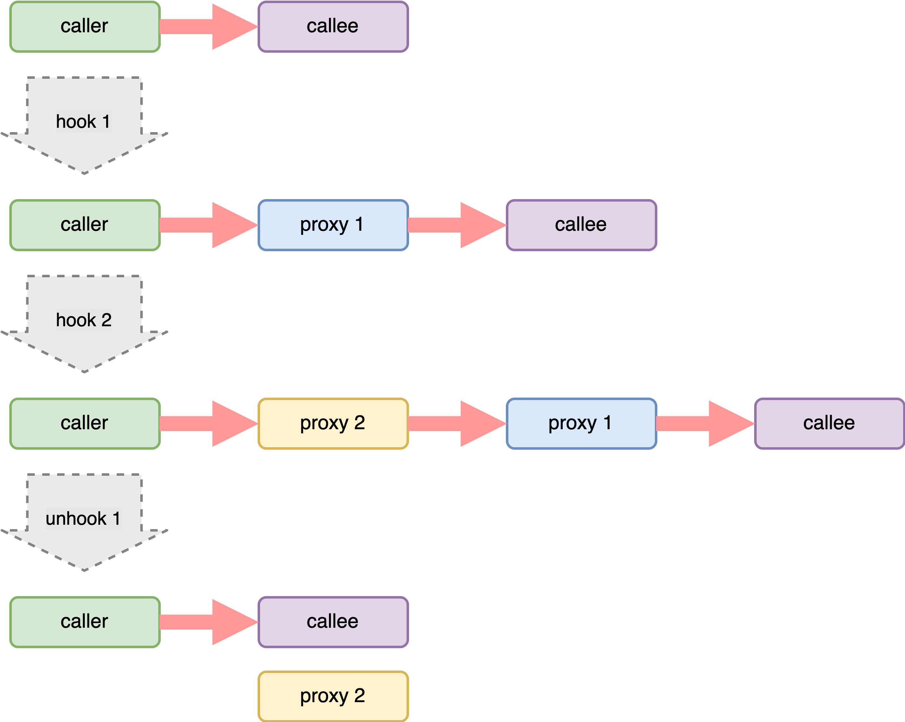
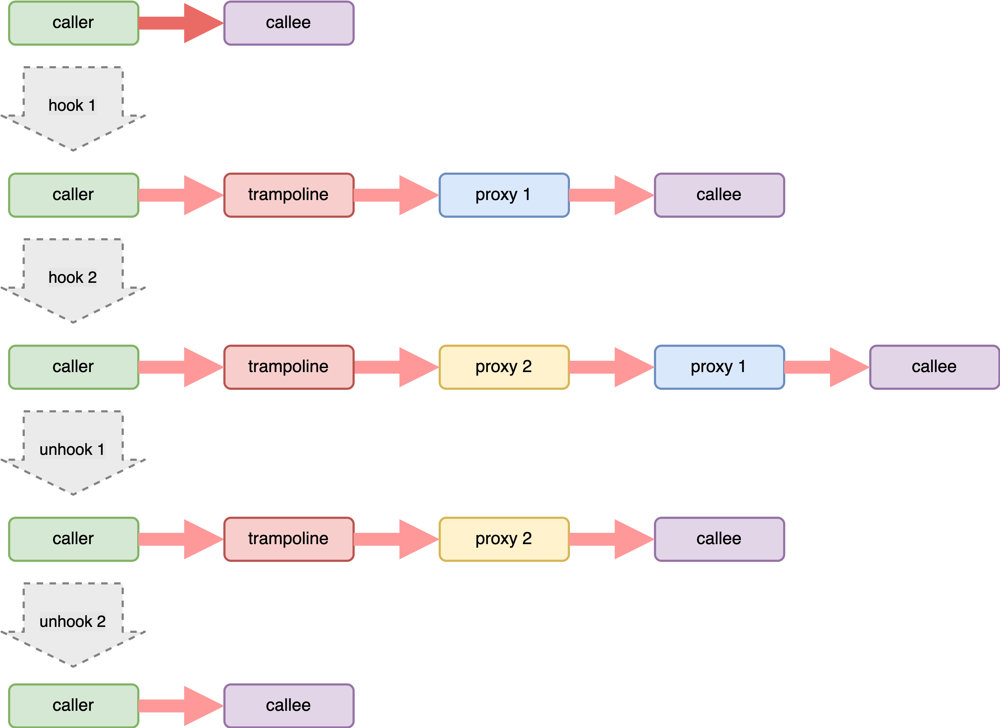

# 项目介绍和原理概述


## Android native hook

随着 Android app 开发的技术栈不断向 native 层扩展，native hook 已经被用于越来越多的技术场景中。Android native hook 的实现方式有很多种，其中使用最广泛，并且通用性最强的是 inline hook 和 PLT hook。

inline hook 的功能无疑是最强大的，它受到的限制很少，几乎可以 hook 任何地方。inline hook 在线下场景中使用的比较多，业内现有的通用的 inline hook 开源方案或多或少都存在一些稳定性问题，而且基本都缺乏大规模的线上验证。

PLT hook 的优点是稳定性可控，可以真正的在线上全量使用。但 PLT hook 只能 hook 通过 PLT 表跳转的函数调用，这在一定程度上限制了它的使用场景。

在真实的线上环境中，经常是 PLT hook 和 inline hook 并存的，这样它们可以各自扬长避短，在不同的场景中发挥作用。


## ELF 

要弄清 Android PLT hook 的原理，需要了解 ELF 文件格式，以及 linker（动态连接器）加载 ELF 文件的过程。

app_process 和 so 库（动态链接库）都是 ELF（Executable and Linkable Format）格式的文件。对于运行时 native hook 来说，我们主要关心最终的产物，即 ELF 文件。

ELF 文件的起始处，有一个固定格式的定长的文件头。ELF 文件头中包含了 SHT（section header table）和 PHT（program header table）在当前 ELF 文件中的起始位置和长度。SHT 和 PHT 分别描述了 ELF 的“连接视图”和“执行视图”的基本信息。



### Execution View（执行视图）

ELF 分为连接视图（Linking View）和执行视图（Execution View）。

* 连接视图：ELF 未被加载到内存执行前，以 section 为单位的数据组织形式。
* 执行视图：ELF 被加载到内存后，以 segment 为单位的数据组织形式。

PLT hook 并不是修改磁盘上的 ELF 文件，而是在运行时修改内存中的数据，因此我们主要关心的是执行视图，即 ELF 被加载到内存后，ELF 中的数据是如何组织和存放的。

linker 依据 ELF 文件执行视图中的信息，用 `mmap` 将 ELF 加载到内存中，执行 relocation（重定位）把外部引用的绝对地址填入 GOT 表和 DATA 中，然后设置内存页的权限，最后调用 init_array 中的各个初始化函数。

PLT hook 执行的时机是在 linker 完全加载完 ELF 之后，我们需要解析内存中的 ELF 数据，然后修改 relocation 的结果。

ELF 中可以包含很多类型的 section（节），下面介绍一些比较重要的，以及和 PLT hook 相关的 section。

### Dynamic section

`.dynamic` 是专门为 linker 设计的，其中包含了 linker 解析和加载 ELF 时会用到的各项数据的索引。linker 在解析完 ELF 头和执行视图的内容后，就会开始解析 `.dynamic`。

### Data（数据）

* `.bss`：未初始化的数据。比如：没有赋初值的全局变量和静态变量。（`.bss` 不占用 ELF 文件体积）
* `.data`：已初始化的非只读数据。比如：`int g_value = 1;`，或者 `size_t (*strlen_ptr)(const char *) = strlen;`（初始化过程需要 linker relocation 参与才能知道外部 `strlen` 函数的绝对地址）
* `.rodata`：已初始化的只读数据，加载完成后所属内存页会被 linker 设置为只读。比如：`const int g_value = 1;`。
* `.data.rel.ro`：已初始化的只读数据，初始化过程需要 linker relocation 参与，加载完成后所属内存页会被 linker 设置为只读。比如：`const size_t (*strlen)(const char *) = strlen;`。

###  Code（代码）

* `.text`：大多数函数被编译成二进制机器指令后，会存放在这里。
* `.init_array`：有时候我们需要在 ELF 被加载后立刻自动执行一些逻辑，比如定义一个全局的 C++ 类的实例，这时候就需要在 `.init_array` 中调用这个类的构造函数。另外，也可以用 `__attribute__((constructor))` 定义单独的 init 函数。
* `.plt`：对外部或内部的符号的调用跳板，`.plt` 会从 `.got` 或 `.data` 或 `.data.rel.ro` 中查询符号的绝对地址，然后执行跳转。

### Symbol（符号）

符号可以分为两类：“动态链接符号”和“内部符号（调试符号）”，这两个符号集合并不存在严格的相互包含关系，调试器一般会同时加载这两种符号。linker 只关心动态链接符号，内部符号并不会被 linker 加载到内存中。执行 PLT hook 时也只关心动态链接符号。

* `.dynstr`：动态链接符号的字符串池，保存了动态链接过程中用到的所有字符串信息，比如：函数名，全局变量名。
* `.dynsym`：动态链接符号的索引信息表，起到“关联”和“描述”的作用。

动态链接符号分为“导入符号”和“导出符号”：

* 导出符号：指当前 ELF 提供给外部使用的符号。比如：libc.so 中的 `open` 就是 libc.so 的导出符号。
* 导入符号：指当前 ELF 需要使用的外部符号。比如：你自己的 libtest.so 如果用到了 `open`，那么 `open` 就会被定义为 libtest.so 的导入符号。

顺便提一下，内部符号的信息包含在 `.symtab`，`.strtab` 和 `.gnu_debugdata` 中。

### hash table（哈希表）

为了加速“动态链接符号的字符串”的查找过程，ELF 中包含了这些字符串的哈希表，通过查哈希表，可以快速确认 ELF 中是否存在某个动态链接符号，以及这个符号对应的信息项在 `.dynsym` 中的偏移位置。

历史原因，Android ELF 中会存在两种格式的哈希表：

* `.hash`：SYSV hash。其中包含了所有的动态链接符号。
* `.gnu.hash`：GNU hash。只包含动态链接符号中的导出符号。

ELF 中可能同时包含 `.hash` 和 `.gnu.hash`，也可能只包含其中一个。具体看 ELF 编译时的静态链接参数 `-Wl,--hash-style`，可以设置为 `sysv` 或 `gnu` 或 `both`。从 Android 6.0 开始，linker 支持了 `.gnu.hash` 的解析。

## linker（动态链接器）



linker 在加载 ELF 时的最主要工作是 relocation（重定位），这个过程的目的是为当前 ELF 的每个“导入符号”找到对应的外部符号（函数或数据）的绝对地址。最终，这些地址会被写入以下几个地方：

* `.got.plt`：保存外部函数的绝对地址。这就是我们经常会听到的 “GOT 表”。
* `.data`，`.data.rel.ro`：保存外部数据（包括函数指针）的绝对地址。

要完成 relocation 过程，需要依赖于 ELF 中的以下信息：

* `.rel.plt`，`.rela.plt`：用于关联 `.dynsym` 和 `.got.plt`。这就是我们经常会听到的 “PLT 表”。
* `.rel.dyn`，`.rela.dyn`，`.rel.dyn.aps2`，`.rela.dyn.aps2`：用于关联 `.dynsym` 和 `.data`，`.data.rel.ro`。

Android 只在 64 位实现中使用 RELA 格式，它比 REL 格式多了附加的 r_addend 字段。另外，Android 从 6.0 开始支持 aps2 格式的 `.rel.dyn` 和 `.rela.dyn` 数据，这是一种 sleb128 编码格式的数据，读取时需要特别的解码逻辑。

relocation 完成之后的函数调用关系如下：



relocation 完成之后的数据引用关系如下：



## Android PLT hook

### PLT hook 基本原理

了解了 ELF 格式和 linker 的 relocation 过程之后，PLT hook 的过程就不言自明了。它做了和 relocation 类似的事情。即：通过符号名，先在 hash table 中找到对应的符号信息（在 `.dynsym` 中），再找到对应的 PLT 信息（在 `.rel.plt` 或 `.rela.plt` 或 `.rel.dyn` 或 `.rela.dyn` 或 `.rel.dyn.aps2` 或 `.rela.dyn.aps2` 中），最后找到绝对地址信息（在 `.got.plt` 或 `.data` 或 `.data.rel.ro` 中）。最后要做的就是修改这个绝对地址的值，改为我们需要的自己的“代理函数”的地址。

要注意的是，在修改这个绝对地址之前，需要先用 `mprotect` 设置当前地址位置所在内存页为“可写”的，因为 linker 在做完 relocation 后会把 `.got.plt` 和 `.data.rel.ro` 设置为只读的。修改完之后，需要用 `__builtin___clear_cache` 来清除该内存位置的 CPU cache，以使修改能立刻生效。

### xHook 的不足之处

[xHook](https://github.com/iqiyi/xHook) 是一个开源较早的 Android PLT hook 方案，受到了很多的关注。xHook 比较好的实现了 ELF 解析和绝对地址替换的工作。但是作为一个工程化的 PLT hook 方案，xHook 存在很多不足之处，主要有：

* native 崩溃兜底机制有缺陷，导致线上崩溃无法完全避免。
* 无法自动对新加载的 ELF 执行 hook。（需要外部反复调用 `refresh` 来“发现”新加载的 ELF。但是在什么时机调用 `refresh` 呢？频率太高会影响性能，频率太低会导致 hook 不及时）
* 由于依赖于链式调用的机制。如果一个调用点被多次 hook，在对某个 proxy 函数执行 unhook 后，链中后续的 proxy 函数就会丢失。
* 只使用了读 maps 的方式来遍历 ELF。在高版本 Android 系统和部分机型中兼容性不好，经常会发生 hook 不到的情况。
* API 设计中使用了正则来指定 hook 哪些目标 ELF，运行效率不佳。
* 需要在真正执行 hook 前，注册完所有的 hook 点，一旦开始执行 hook（调用 `refresh` 后），不能再添加 hook 点。这种设计是很不友好的。
* 无法适配 Android 8.0 引入 Linker Namespace 机制（同一个函数符号，在进程中可能存在多个实现）。

由于存在上述这些稳定性、有效性、功能性上的问题，使 xHook 难以真正大规模的用于线上环境中。

### 更完善的 Android PLT hook 方案

我们迫切需要一个新的更完善的 Android PLT hook 方案，它应该是什么样子的呢？我认为它应该满足这些条件：

* 要有一套真正可靠的 native 崩溃兜底机制，来避免可控范围内的 native 崩溃。
* 可以随时 hook 和 unhook 单个、部分、全部的调用者 ELF。
* 当新的 ELF 被加载到内存后，它应该自动的被执行所有预定的 hook 操作。
* 多个使用方如果 hook 了同一个调用点，它们应该可以彼此独立的执行 unhook，相互不干扰。
* 为了适配 Android linker namespace，应该可以指定 hook 函数的被调用者 ELF。
* 能自动避免由于 hook 引起的意外的“递归调用”和“环形调用”。比如：`open` 的 proxy 函数中调用了 `read`，然后 `read` 的 proxy 函数中又调用了 `open`。如果这两个 proxy 存在于两个独立的 SDK 中，此时形成的环形调用将很难在 SDK 开发阶段被发现。如果在更多的 SDK 之间形成了一个更大的 proxy 函数调用环，情况将会失去控制。
* proxy 函数中要能以正常的方式获取 backtrace（libunwind、libunwindstack、llvm libunwind、FP unwind 等）。有大量的业务场景是需要 hook 后在 proxy 函数中抓取和保存 backtrace，然后在特定的时机 dump 和聚合这些 backtrace，符号化后再将数据投递到服务端，从而监控和发现业务问题。
* hook 管理机制本身带来的额外性能损耗要足够低。

我们带着上面的这些目标设计和开发了 ByteHook。


## 字节 ByteHook 介绍

ELF 和 linker 前面已经介绍过了，下面介绍 ByteHook 中另外几个关键模块。



### DL monitor

在 Android 系统中，动态加载 so 库最终是通过 `dlopen` 和 `android_dlopen_ext` 完成的，通过 `dlclose` 则可以卸载 so 库。

ByteHook 在内部 hook 了这三个函数调用。因此，当有新的 so 被加载到内存后，ByteHook 能立刻感知到，于是可以立刻对它执行预定的 hook 任务。当有 so 正在被卸载时，ByteHook 也能立刻感知到，并且会通过内部的读写锁机制与“ELF cache 和 hook 执行模块”同步，以此保证“正在被 hook 的 so 不会正在被卸载”。

Android 从 7.0 开始不再允许 app 中 `dlopen` 系统库；从 8.0 开始引入了 linker namespace 机制，并且 libdl.so 不再是 linker 的虚拟入口，而成为了一个真实的 so 文件。对于 linker 来说，Android 7.0 和 8.0 是两个重要的版本。

我们需要设法绕过系统对 app `dlopen` 系统库的限制，否则 hook `dlopen` 和 `android_dlopen_ext` 之后，在代理函数中是无法直接调用原始的 `dlopen` 和 `android_dlopen_ext` 函数的。

这里我们参考了 [ByteDance Raphael](https://github.com/bytedance/memory-leak-detector) 的做法。在 Android 7.0 中，hook `dlopen` 和 `android_dlopen_ext` 后不再调用原函数，而是调用 linker 中的以下内部函数来绕过限制：

```
__dl__ZL10dlopen_extPKciPK17android_dlextinfoPv
__dl__Z9do_dlopenPKciPK17android_dlextinfoPv
__dl__Z23linker_get_error_bufferv
__dl__ZL23__bionic_format_dlerrorPKcS0_
```

从 Android 8.0 开始，可以直接 hook libdl.so 中的以下函数，再直接调用原函数即可：

```
__loader_dlopen
__loader_android_dlopen_ext
```

### trampoline

简单的 PLT hook 方案（比如 xHook）是不需要 trampoline 的，只需要替换 `.got.plt`（和 `.data` 和 `.data.rel.ro`）中的绝对地址就可以了。但是这种方式会导致“同一个 hook 点的多个 proxy 函数形成链式调用”（类似于 Linux 通过 `sigaction` 注册的 signal handler），如果其中一个 proxy 被 unhook 了，那么“链” 中后续的 proxy 也会丢失。xHook 就存在这个问题：



当 proxy 1 被 unhook 后，proxy 2 也从调用链上消失了，因为 proxy 1 根本不知道 proxy 2 的存在，在 unhook proxy 1 时，会试图恢复最初的初始值，即 callee 的地址。

为了解决这个问题，对于每个被 hook 的函数调用点，我们都需要一个对应的管理入口函数，我们改为在 GOT 表中写入这个管理入口函数的地址。同时，对于每个被 hook 的函数调用点，我们还需要维护一个 proxy 函数列表，在管理入口函数中，需要遍历和调用 proxy 函数列表中的每一个具体 proxy 函数。

为了在运行时达到指定跳转的效果，我们需要用 `mmap` 和 `mprotect` 来创建 shellcode。按照术语惯例，我们把这里创建的跳转逻辑称为 trampoline（蹦床）：



另外，为了检测和避免“环形调用”，每次 trampoline 开始执行时，都会开始记录 proxy 函数的执行栈，在 proxy 函数链中遍历执行时，会检测当前待执行的 proxy 函数是否已经在执行栈中出现过，如果出现过，就说明发生了“环形调用”，此时会忽略 proxy 函数链中后续所有的 proxy 函数，直接执行最后的“原函数”。

trampoline 实现的难点在于性能。trampoline 给执行流程注入了额外的逻辑，在多线程环境中，proxy 调用链会被高频的遍历，其中保存的 proxy 函数可能随时会增加和减少，我们还需要保存 proxy 函数的执行栈。所有这些逻辑都不能加锁，否则 hook 高频函数时，性能损耗会比较明显。


### native 崩溃兜底

执行 hook 操作时，需要直接计算很多的内存绝对地址，然后对这些内存位置进行读写，但这样做并不总是安全的，我们可能会遇到这些情况：

* 在 DL monitor 初始化的过程中，对 `dlclose` 的 hook 尚未完成时，此时 linker 执行了 `dlclose`，恰恰 dlclose 了我们正在执行 `dlclose` hook 操作的 ELF。
* ELF 文件可能意外损坏，导致 linker 加载了格式不正确的 ELF。

这时候，对指定内存位置的读写可能会发生 sigsegv 或 sigbus，导致 native 崩溃。我们需要一种类似 Java / C++ try-catch 的机制来保护这种危险的操作，避免发生崩溃：

```C
int *p = NULL;

TRY(SIGSEGV, SIGBUS) {
    *p = 1;
} CATCH() {
    LOG("There was a problem, but it's okay.");
} EXIT
```

当崩溃发生时，因为我们明白在保护的代码区间中只有“内存读”或“单个内存写”操作，因此忽略这种崩溃并不会带来任何副作用。在 Java 虚拟机中，也有类似的机制用于检测 native 崩溃，并且创建合适的 Java 异常。

ByteHook 通过注册 sigsegv 和 sigbus 信号处理函数来进行 native 崩溃兜底，在 try 块开头用 `sigsetjmp` 保存寄存器和 sigmask，当发生崩溃时，在信号处理函数中用 `siglongjmp` 跳转到 catch 块中并恢复 sigmask。

值得注意的几个问题：

* ART sigchain 代理了 `sigaction`，`sigprocmask` 等函数，我们需要用 `dlsym` 在 libc.so 中找到原始的函数再调用它们。
* bionic 和 ART sigchain 在某些 AOSP 版本上存在 bug，所以我们需要优先使用 `sigaction64` 和 `sigprocmask64`，而不是 `sigaction` 和 `sigprocmask`。
* 在正确的地方用正确的方式设置 sigmask 很重要。
* 我们的 try-catch 机制运行于多线程环境中，所以需要以某种线程独立的方式来保存 `sigjmp_buf`。
* 考虑到性能和更多使用场景，整个机制需要无锁、无堆内存分配、无 TLS 操作、线程安全，异步信号安全。

ByteHook 的 native 崩溃兜底模块经过了比较严格的压力测试和线上测试，如果正确的使用，可以达到预期的效果。如你在 ByteHook 的源码中所见，我们故意把这个模块设计成现在的样子（只有一个 `.c` 和 一个 `.h` 文件，并且没有任何外部依赖），这样做的好处是容易移植和复用。如果你想把这个模块用在自己的工程中，请注意以下几点：

* native 崩溃兜底属于“高危”操作，可能引起不确定的难以排查的问题。所以能不用尽量不要用。
* 纯业务类型的 native 库请不要使用 native 崩溃兜底。而是应该让崩溃暴露出来，然后修复问题。
* try 块中的逻辑越少越好。比如兜底 sigsegv 和 sigbus 时，最好 try 块中只有一些内存地址的读操作和单个写操作，尽量不要调用外部函数（包括 `malloc`，`free`，`new`，`delete` 等）。
* try 块中尽量不要使用 C++。某些 C++ 的语法封装，编译器会为它生成一些意外的逻辑（比如读写 C++ TLS 变量，编译器会生成 `_emutls_get_address` 调用，其中可能会调用 `malloc`）。
* 在当前的设计中：try 块中请不要调用 return，否则会跳过 catch 或 exit 块中的回收逻辑，引起难以排查的问题。另外，在 try 块中不可以嵌套使用另一个“相同信号的 try”。
